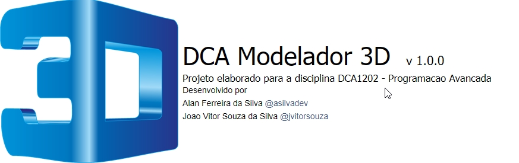
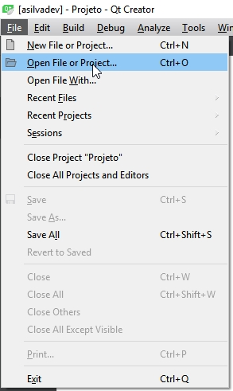
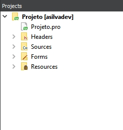
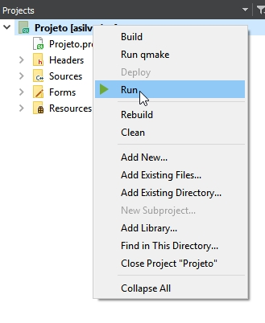
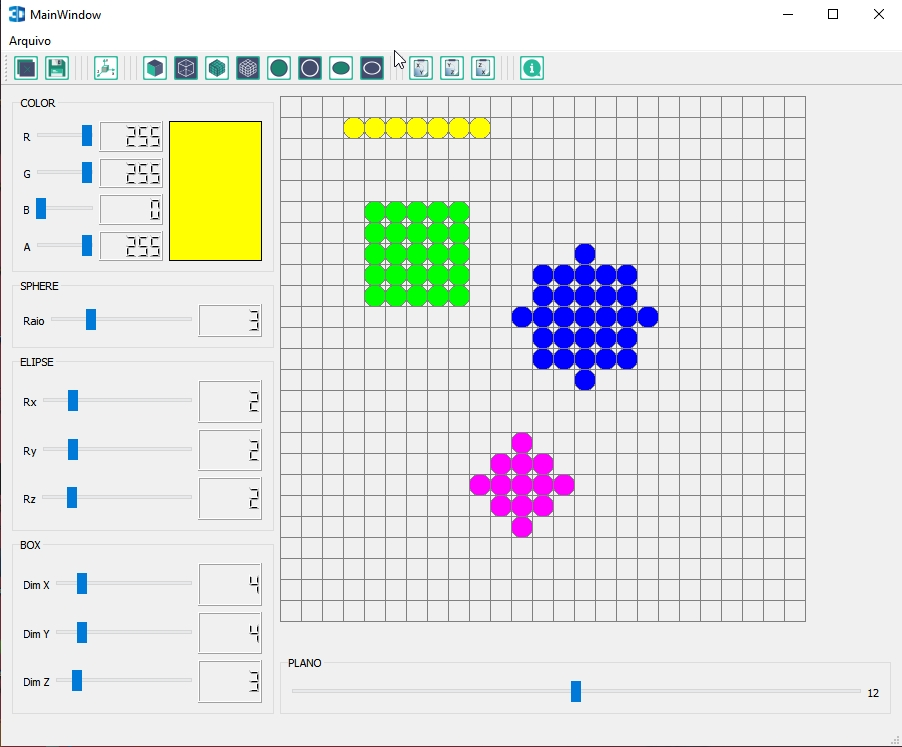
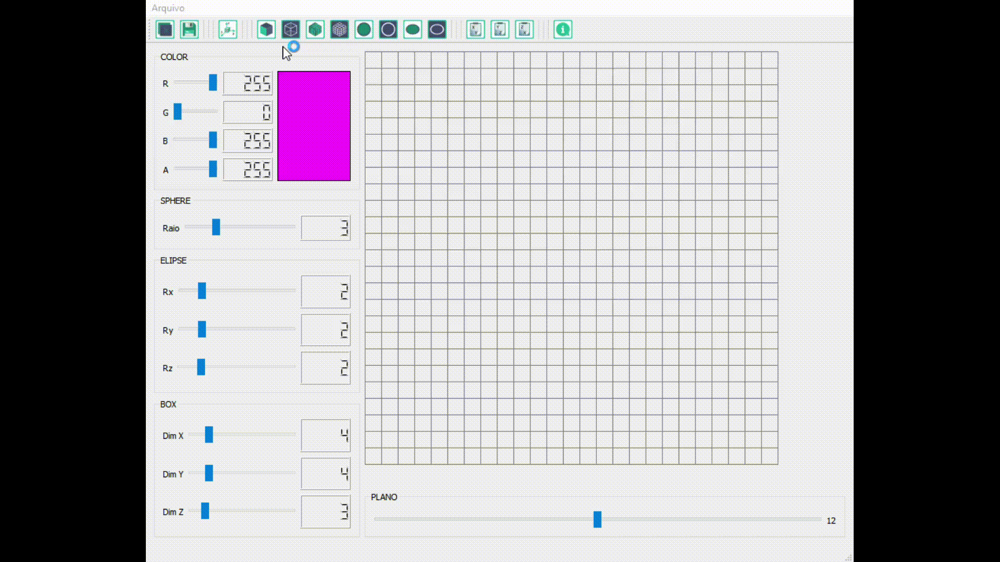

## Programas necessários
- QT Creator
- Git 

## Instalação (Windowns)

1 - Baixe e instale o QT
> https://www.qt.io/download

**OBS**: É necessário selecionar o compilador `MinGW 32-bit` na hora da instalação

2 - Baixe e instale o Git 
> https://git-scm.com/downloads

3 - Baixe o repositório 

>  git clone https://github.com/asilvadev/DCA-Modelador-3D.git

ou

> git clone git@github.com:asilvadev/DCA-Modelador-3D.git

4 - Abra o projeto no QT
> Ctrl + O

5 - Execute o projeto
> Ctrl + R

## Funções

|   PUT   |   CUT   | PLANOS | DIMENSOES | SALVAR |
| :-----: | :-----: | :----: | :-------: | :----: |
|  Voxel  |  Voxel  |  X-Y   |     X     | .VECT  |
|   Box   |   Box   |  Y-Z   |     Y     |  .OFF  |
| Sphere  | Sphere  |  Z-X   |     Z     |   -    |
| Ellipse | Ellipse |   -    |     -     |   -    |

